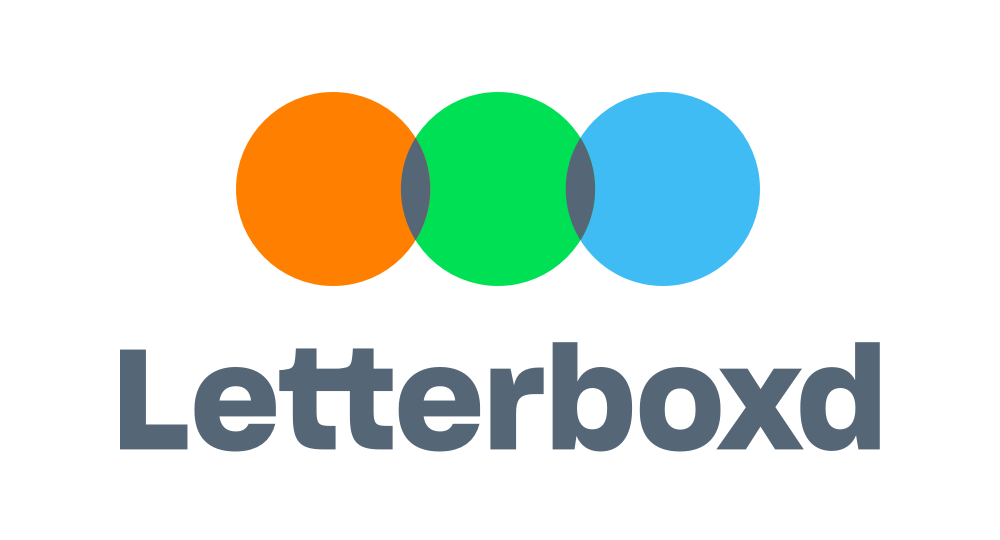

# Letterboxd Wrapped Analysis


Why pay $20 for a personalized Letterboxd Wrapped when you can leverage your skills and spend 20 hours creating a similar analysis yourself? While some might argue it's a waste of time (and they're right), the joy of discovery often outweighs convenience.

This repository contains a proof of concept (POC) for recreating Letterboxd Wrapped using tools available to any tech-savvy user.

## What is Letterboxd?

[Letterboxd](https://letterboxd.com/) is a social media platform for movie enthusiasts where users can log, rate, and review the films they've watched. Every year, Letterboxd releases a "wrapped" feature, similar to Spotify Wrapped, aggregating your account's most interesting data.

## Project Highlights

Initially, the goal was to create a Jupyter notebook to compute these results. However, after discovering this [post by one of Marimo's founders](https://www.linkedin.com/posts/akshayka_marimo-notebooks-query-polars-dataframes-activity-7279937560934526976-fZqG?utm_source=share&utm_medium=member_desktop), the analysis quickly evolved into a fully interactive app.

### Why Marimo?

Marimo is a powerful framework for creating prototypes quickly, offering features such as:
- Exporting notebooks to various formats, including WebAssembly (WASM).
- Deploying projects effortlessly via [GitHub Pages](https://github.com/marimo-team/marimo-gh-pages-template).

With Marimo, the analysis notebook transforms into a fully interactive app, allowing users to adjust values, input files, and more.

### Result

The final interactive app can be found here:  
👉 [Letterboxd Wrapped App](https://mameli.github.io/letterboxd_wrapped/)

## Pros and Cons of Using Marimo

### Pros:
- **Rapid Prototyping:** Marimo simplifies the development of interactive Python prototypes.
- **Modern Stack Integration:** Works seamlessly with UV, Polars, and DuckDB for efficient data analysis.

### Cons:
- **Load Times:** Each access requires downloading Python dependencies, resulting in slow load times.
- **Library Integration Issues:** Some libraries, like Matplotlib, don't integrate smoothly, necessitating alternatives such as Plotly.

## Technologies Used

- **Python Libraries:** Polars, Plotly
- **Framework:** Marimo
- **Deployment:** GitHub Pages

## How to Run the App Locally

1. Clone the repository:
   ```bash
   git clone https://github.com/mameli/letterboxd_wrapped.git
   cd letterboxd_wrapped
   ```

2. Install the dependencies:
   ```bash
   uv sync
   ```

3. Run the app:
   ```bash
   uv run marimo edit apps/wrapped.py 
   ```
# marimo WebAssembly + GitHub Pages Template

This template repository demonstrates how to export [marimo](https://marimo.io) notebooks to WebAssembly and deploy them to GitHub Pages.

## 📚 Included Examples

- `apps/charts.py`: Interactive data visualization with Altair
- `notebooks/fibonacci.py`: Interactive Fibonacci sequence calculator

## 🚀 Usage

1. Fork this repository
2. Add your marimo files to the `notebooks/` or `apps/` directory
   1. `notebooks/` notebooks are exported with `--mode edit`
   2. `apps/` notebooks are exported with `--mode run`
3. Push to main branch
4. Go to repository **Settings > Pages** and change the "Source" dropdown to "GitHub Actions"
5. GitHub Actions will automatically build and deploy to Pages
